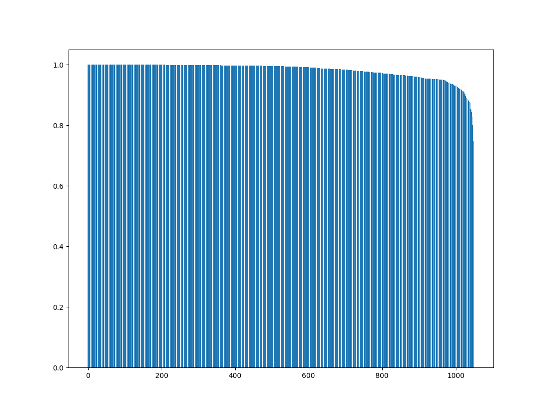

# numerai

## V3 to V4
Mapping of feature names is [here](v3_to_v4_feature_mapping.csv). This mapping is based on analysis of round 311 live data.

Correlation is high for most of the 1050 features, however there are about 20-30 with correlation below 0.9. If these features have high importance in your model then it is less likely you can maintain performance by simply mapping to the new features.

Plot of sorted feature correlations:

For reference, the correlations of the mapped features are included in the mapping csv file.
 
## V2 to V3
Mapping of feature names is [here](v2_to_v3_feature_mapping.csv).

Mapping of era numbers is [here](v2_to_v3_era_mapping.csv).
